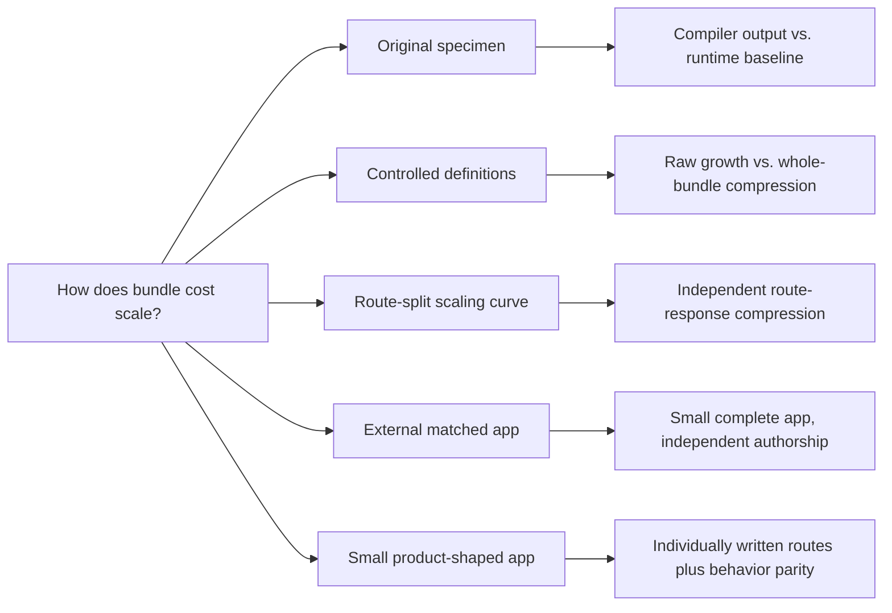

# Vue–Svelte Bundle Scaling, Revisited

## TL;DR

- Svelte is the likely bundle-size winner for Hello World demos, isolated
  widgets, and small initial routes.
- Vue is likely to be smaller for medium-to-large applications, especially when
  users load many routes.


## Why this benchmark exists

In paraphrase, Svelte advocates argue:

- “Svelte avoids the upfront cost of a large framework runtime by compiling
  components into tiny standalone modules.” ([Svelte:
  *Frameworks without the
  framework*](https://web.archive.org/web/20260727134238/https://svelte.dev/blog/frameworks-without-the-framework))
- “Moving more framework work into the compiler is what makes Svelte
  applications small and fast.” ([Svelte:
  *Svelte 5 is
  alive*](https://web.archive.org/web/20260727134144/https://svelte.dev/blog/svelte-5-is-alive))
- “The framework largely disappears before the browser loads the page, so
  users receive mostly application code.” ([Vercel:
  *What is
  Svelte?*](https://web.archive.org/web/20260727134258/https://vercel.com/i/what-is-svelte))
- “Svelte produces a smaller JavaScript payload than Vue because Vue sends more
  framework logic to the browser.” ([Vercel:
  *How Svelte compares with other
  frameworks*](https://web.archive.org/web/20260727134258/https://vercel.com/i/what-is-svelte#how-svelte-compares-with-other-frameworks))
- “Equivalent Svelte bundles are roughly half the size of Vue bundles, and the
  absolute gap remains as applications grow.” ([PkgPulse:
  *Vue 3 vs. Svelte
  5*](https://web.archive.org/web/20260727134421/https://www.pkgpulse.com/guides/vue-3-vs-svelte-5-2026#bundle-size))
- “A small Vue build can be about ten times larger than its Svelte equivalent.”
  ([ButterCMS:
  *Svelte vs.
  Vue*](https://web.archive.org/web/20260727134449/https://buttercms.com/blog/svelte-vs-vue-which-one-to-choose/#bundle-size))

## Vue amortization

In 2021, Vue creator Evan You responded to these claims with a
[comparison](https://github.com/yyx990803/vue-svelte-size-analysis/blob/7bb60ff681a3f5016e8af26084e72100cd37a876/README.md#analysis)
showing that while Svelte had a dramatically smaller framework baseline, Vue
was designed around amortization: Vue paid more upfront but generated
substantially less component code. Given enough components and application
code, that lower marginal cost could repay the larger baseline. He concluded
that Svelte provided a compelling advantage for isolated components, but that
its generated-code cost could become a disadvantage for medium-to-large
applications. This is also clearly documented in the Vue FAQ:
[https://vuejs.org/about/faq#is-vue-lightweight](https://web.archive.org/web/20260727134318/https://vuejs.org/about/faq#is-vue-lightweight).

Evan’s specimen was TodoMVC, a tiny application rather than a large product.
Even at that scale, Vue was already generating less component-specific code
than Svelte. That does not mean the complete Vue bundle was smaller—Svelte’s
much smaller runtime still kept its total ahead. It means Vue’s amortization
had already begun: every additional component could continue paying down its
larger shared baseline.

## Is this still true in 2026?

Yes. We put together this updated example to build on and expand Evan You’s
original comparison five years later, using a current toolchain and broader
benchmarks.

## Updated packages for the 2026 benchmark

- Vue 3.5.40
- Svelte 5.56.8
- Vite 8.1.5
- `@vitejs/plugin-vue` 6.0.8
- `@sveltejs/vite-plugin-svelte` 7.2.0
- Node.js 22.19.0

## New statistics for the 2026 benchmark

- Component-only output and complete production bundles
- Raw, gzip, and Brotli sizes
- CSR, hydration, and SSR output
- Initial-route, lazy-route, and complete-traversal transfer
- Marginal bytes per component and estimated crossover points
- Generated scaling workloads and independently authored application controls

That is the overview, and if that is all you came for, that is all you need to
read. To run the benchmarks yourself, see [Reproduce it](#reproduce-it).
Everything below gets into a more technical discussion of the workloads,
results, and limitations.

If you want that detail, read on.

## The nitty-gritty

Five years of framework and build-tool changes make the historical component
counts unsuitable as present-day thresholds. Svelte 5 is a major architectural
rewrite with shared signal-based runtime machinery, and
[its own release account says that larger applications exposed limitations in
the compiler-dominated Svelte 4
design](https://web.archive.org/web/20260727134144/https://svelte.dev/blog/svelte-5-is-alive#what-changed-and-why).
Vue and Vite have also changed substantially.

### What the larger fixtures represent

The larger scaling workloads do not loop over one TodoMVC component at
runtime. They generate hundreds of distinct component modules to simulate the
compiled source graph of a larger application. The route-split workload also
distributes eight different behavior families across independently transferred
routes. These are deliberate scaling tests, not claims that one TodoMVC
application contains hundreds of components.

The independently authored control is an eight-route, 33-component
product-shaped application. Svelte remains 7,604 B smaller across a complete
cold traversal, but every lazy feature file is smaller with Vue after Brotli.
That result shows the same distinction in a small application: Vue’s marginal
amortization benefit is already visible even though the complete application
has not crossed over.

The benchmark also tests several questions the original arithmetic could not
answer:

- What happens when complete production applications are bundled and compressed
  together instead of multiplying one isolated component?
- How strongly does repeated generated code benefit from gzip and Brotli?
- What happens when an application contains different kinds of features rather
  than hundreds of near-clones?
- What happens when lazy-loaded files are transferred and compressed
  separately, as they are in a browser?
- Do independently maintained and individually written small applications
  support the same direction of growth?

The simplified model remains:

```text
Vue application    = larger shared baseline + lower marginal component cost
Svelte application = smaller shared baseline + higher marginal component cost
```

The benchmark asks whether that model survives current compilers and the way
browsers actually receive production JavaScript.

## Results at a glance

| Workload | What is held constant | Result |
| --- | --- | --- |
| Original 2021 TodoMVC source | Same historical component source, current compilers | Vue component-only output was 1,306 B Brotli; Svelte was 1,500 B. Complete Svelte bundles were still 9–10 kB smaller. |
| Controlled scaling | 0–640 distinct generated definitions, complete production builds | Vue crossed in raw client JavaScript near 272–326 components, depending on lane and component shape. No compressed crossover appeared through 640 near-clones. |
| Route-split scaling stress test | Eight different UI behaviors per independently compressed lazy response | Vue crossed in this generated workload near 241 compact definitions with gzip and 339 with Brotli. |
| Independently maintained matched app | Keyed `js-framework-benchmark` implementations | Svelte was 9,919 B smaller with Brotli. |
| Small product-shaped app | Same 8-route, 33-component behavior contract | Svelte was 7,604 B smaller for a complete cold traversal and 8,400 B smaller initially. The complete gap narrowed as routes were added. |

The route-split scaling row is the crossover shown in the opening chart. The
final two rows are the control against overstating it: Svelte remains
decisively smaller in the complete small applications measured here. In the
33-component product-shaped application, every lazy feature file was smaller
with Vue after Brotli, but those savings had not yet repaid Vue’s larger
starting point.

## What these benchmarks establish

The results establish the amortization mechanism and support a practical
inference: **as an application accumulates many distinct features spread across
lazy-loaded files, Vue becomes increasingly likely to erase Svelte’s initial
advantage and become smaller overall.** They do not provide one crossover
boundary for every codebase.

1. **Svelte starts substantially smaller.** It won every complete
   small-application comparison in this repository. For the small
   product-shaped application, Svelte’s initial JavaScript was 8,400 B smaller
   with Brotli.
2. **Vue can add less code as an application grows.** All seven lazy feature
   routes in the small product-shaped application were 32–201 B smaller with
   Vue after Brotli. The application did not grow far enough to repay Vue’s
   larger initial entry, but the direction of the marginal cost was consistent.
3. **Compression invalidates simple per-component arithmetic.** Vue became
   smaller in raw client JavaScript in the controlled workload, while Svelte
   remained smaller after gzip and Brotli because hundreds of similar
   compiler-generated patterns compressed exceptionally well.
4. **Chunk boundaries can reverse the compressed result.** In the route-split
   scaling workload, each lazy response had its own compression dictionary.
   Vue crossed from larger to smaller near 241 compact definitions with gzip
   and 339 with Brotli. This proves that Vue’s amortization can become a real
   transfer-size advantage, not that every application will cross at those
   counts.
5. **Bundle size and runtime performance are different questions.** These
   measurements say how much JavaScript was emitted and transferred. They do
   not establish which framework renders faster, uses less memory, or produces
   the more responsive application.

The benchmark rules out two universal slogans:

- Svelte’s smaller runtime does **not** guarantee the smaller substantial
  application.
- Vue’s smaller marginal output does **not** guarantee that a particular
  application will ever repay its runtime baseline.

The positive Vue takeaway is clear: its runtime cost is amortizable in both raw
code and compressed transfer. Choosing Vue means accepting a higher starting
point, not a permanently larger application. For a medium-to-large product
with many different features, these results make Vue the stronger default
bundle-size prediction.

### Initial load and cumulative application transfer are different budgets

The benchmark does not assume that building every route makes the browser
download every route. A route-split application has several relevant
boundaries:

```text
cold initial route
shared runtime + application entry + initial route chunks

continued navigation
+ each newly loaded feature chunk

complete cold traversal
the union of every JavaScript response loaded across all sampled routes
```

Svelte’s smaller starting point is most valuable in the first boundary. Vue’s
amortization can occur within one sufficiently substantial route or
cumulatively as an engaged session loads more features. It only applies to
code the user actually receives: one hundred unvisited lazy routes do not repay
Vue’s runtime for a user who visits one small screen.

The route-split scaling result reports a complete cold traversal. It counts
each independently compressed JavaScript response once, matching a session
that eventually visits every sampled route with an initially empty cache. It
does not claim that every user follows that journey.

Within a running application, already loaded modules are reused rather than
fetched on every navigation. Across visits, unchanged content-hashed assets
can also be reused from the browser’s HTTP cache when deployed with appropriate
cache headers. Both frameworks receive that benefit. A new deployment, cache
eviction, private session, or different device can restore the cold cost, so
caching does not erase the initial-load result.

This is why the repository reports initial transfer, individual lazy
responses, complete cold traversal, and coalesced compression separately.
“Bundle size” is not one number until the delivery and navigation model is
specified.

| Application being considered | What this evidence supports |
| --- | --- |
| Widget or very small client application | Svelte is likely to begin with a meaningful bundle-size advantage. |
| Application near the complete specimens tested here | Svelte was smaller overall in both matched applications. |
| Medium-to-large application with many different features and lazy-loaded routes | Vue is increasingly likely to amortize its runtime and become smaller; the generated workload demonstrates the crossover after gzip and Brotli. |
| Existing production product with routers, stores, editors, grids, and UI libraries | This repository cannot predict the result. Build the same representative product slice in both frameworks and measure its actual response graph. |

Compilation changes where framework code lives and how its cost grows; it does
not make that cost disappear. Svelte’s headline size advantage is strongest at
the small end and must be remeasured as the real application develops.

## Why five workloads?

Every compact framework benchmark hides something:

- Isolated compiler output excludes the shared runtime that a browser receives.
- Multiplying one compressed component assumes compression costs are additive.
- Cloning one component hundreds of times gives the compressor an unrealistic
  amount of repeated structure.
- A complete small demo captures the runtime but not application growth.
- A generated “large app” can accidentally encode its desired conclusion.



This repository keeps those questions separate instead of asking one specimen
to represent all of them. Read [the analysis](analysis.md) for the conclusions
and [the methodology](METHODOLOGY.md) for the exact measurement model.

## How the benchmark measures transfer size

Every production build uses:

- exact framework and Vite versions from `package-lock.json`;
- the same ES2022 target;
- Vite 8’s Oxc production minifier;
- no source maps;
- gzip level 9;
- Brotli quality 11.

Raw means **minified JavaScript before transport compression**, not framework
source. For code-split applications, gzip and Brotli are applied to every
emitted JavaScript file independently and then summed. That models separate
HTTP responses: a browser cannot use the compression dictionary from one route
chunk to decode another.

The reports also retain a “coalesced” diagnostic that concatenates all emitted
JavaScript before compression. It is deliberately not described as transfer
size. Its purpose is to reveal how much a workload benefits from repetition
across files.

## What this repository does not measure

It does not benchmark rendering speed, memory, developer productivity,
accessibility, type tooling, ecosystem quality, or migration cost. It does not
include a router, store, component suite, grid, editor, analytics client, or
other shared dependency in the small product-shaped application. Those
packages often dominate a product bundle and can change the result in either
direction.

The server-rendering lane is a generated-server-code diagnostic, not browser
transfer. The original-specimen Svelte file intentionally retains its legacy
syntax to preserve the 2021 input; it is not presented as idiomatic Svelte 5.

For a framework decision, port a representative vertical slice of the actual
product, retain its real lazy boundaries and specialist dependencies, build
both versions with the deployment pipeline, and measure the responses users
will receive.

## Reproduce it

Requirements:

- Node.js 22.19.0 (also recorded in `.nvmrc`)
- npm
- network access for the two commit-pinned upstream specimen lanes
- Chromium only if running the optional behavior-parity test

Install exactly the locked dependency graph:

```bash
npm ci
```

Run every benchmark lane:

```bash
npm run benchmark:all
npm run verify
```

Run one lane:

```bash
npm run benchmark:original
npm run benchmark
npm run benchmark:route-split
npm run benchmark:matched-app
npm run benchmark:hand-authored
```

Generate the committed charts:

```bash
npm run charts
```

Run the small product-shaped application’s behavior contract:

```bash
npx playwright install chromium
npm test
```

Chromium is not used to compile, minify, compress, or measure bundles.
Playwright opens both complete fixtures and performs the same interactions so
that unlike behavior cannot be rewarded with a smaller result. The browser and
test code are development-only dependencies and never enter a measured bundle.

## Repository map

| Path | Purpose |
| --- | --- |
| [`METHODOLOGY.md`](METHODOLOGY.md) | Benchmark questions, controls, compression model, equivalence rules, and limitations |
| [`analysis.md`](analysis.md) | Evidence-backed interpretation of all five lanes |
| [`results.json`](results.json) / [`results.md`](results.md) | Controlled 0–640-definition matrix |
| [`original-specimen.json`](original-specimen.json) / [`original-specimen.md`](original-specimen.md) | Current compilation of the exact 2021 specimen |
| [`route-split.json`](route-split.json) / [`route-split.md`](route-split.md) | Generated route-split scaling curve |
| [`matched-app.json`](matched-app.json) / [`matched-app.md`](matched-app.md) | Commit-pinned external matched application |
| [`hand-authored.json`](hand-authored.json) / [`hand-authored.md`](hand-authored.md) | Independently authored 8-route application |
| [`fixtures/hand-authored/SPEC.md`](fixtures/hand-authored/SPEC.md) | Framework-neutral behavior contract fixed before measurement |
| [`tests/hand-authored-parity.spec.mjs`](tests/hand-authored-parity.spec.mjs) | Identical Playwright assertions against Vue and Svelte |
| [`results-lock.json`](results-lock.json) | Cross-platform normalized SHA-256 hashes for generated JSON |
| [`docs/research/source-ledger.md`](docs/research/source-ledger.md) | Primary-source and provenance ledger |

## Provenance

- Evan You’s [original analysis and source
  specimen](https://github.com/yyx990803/vue-svelte-size-analysis/tree/7bb60ff681a3f5016e8af26084e72100cd37a876)
  are pinned at commit `7bb60ff681a3f5016e8af26084e72100cd37a876`.
- The matched Vue and Svelte applications come from
  [`js-framework-benchmark`](https://github.com/krausest/js-framework-benchmark/tree/6bd71fcab935b7e4c627b7c394a86633fcd8feea)
  at commit `6bd71fcab935b7e4c627b7c394a86633fcd8feea`,
  under Apache-2.0.
- Framework and tool versions are exact, not semver ranges.
- Generated JSON records SHA-256 digests for every downloaded source file.
- Mutable web claims link to dated Wayback snapshots; GitHub evidence links to
  exact commits. The [source ledger](docs/research/source-ledger.md) preserves
  both the live and immutable locations.
- Generated work directories are deleted by default. Set
  `KEEP_BENCH_WORK=1` for the controlled lane when inspecting compiler output.

## License

The benchmark harness and original fixtures in this repository are available
under the [MIT License](LICENSE). Fetched upstream specimens retain their
respective upstream licenses and are not committed here.
