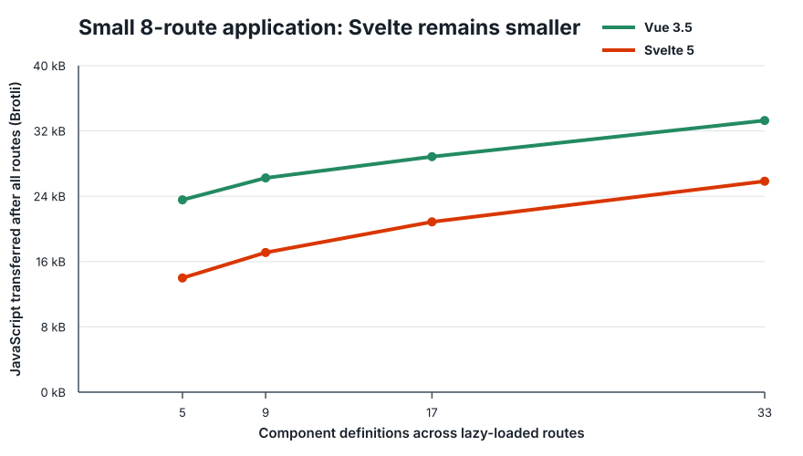
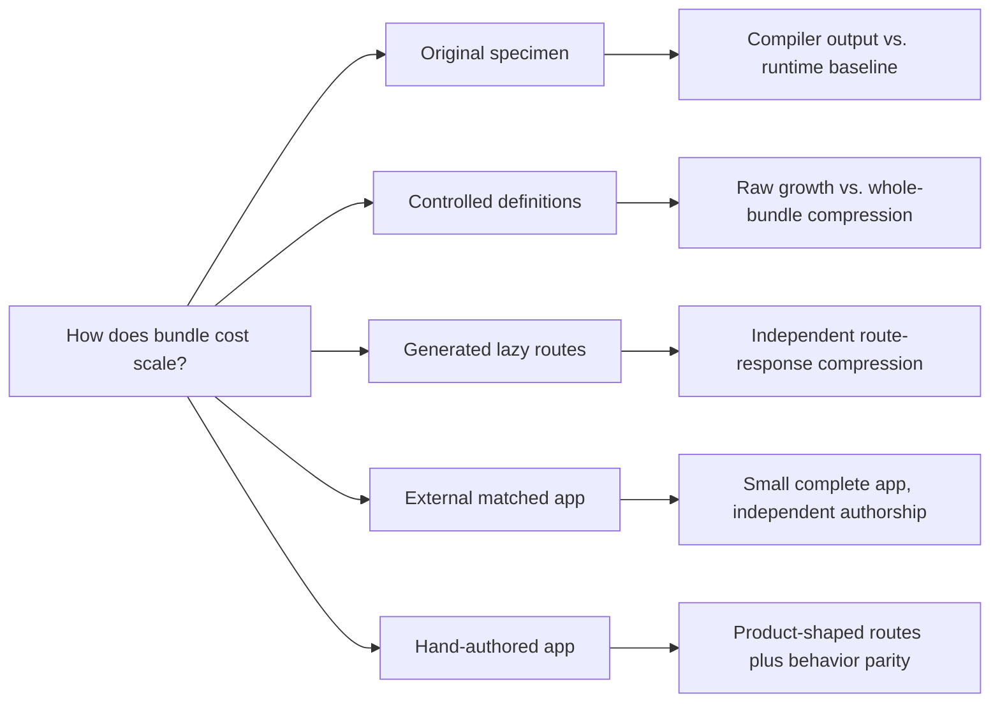

# Vue–Svelte Bundle Scaling, Revisited

This repository reproduces Evan You’s 2021
[`vue-svelte-size-analysis`](https://github.com/yyx990803/vue-svelte-size-analysis)
with Vue 3.5, Svelte 5, and Vite 8, then tests the architectural claim under
four progressively more realistic workloads.

The short result is not “Vue is always smaller” or “Svelte is always smaller.”
It is more useful:

> Svelte’s smaller runtime gives it a substantial advantage in the small
> complete applications tested here. Vue still emits less raw client code per
> component in the controlled workloads. That lower growth can repay Vue’s
> larger baseline, and it can survive gzip and Brotli when diverse components
> are distributed across independently compressed route chunks. The crossover
> depends on the application and its chunk graph, not a universal component
> count.

All dependencies, upstream specimens, upstream source-file digests,
compression settings, measurements, and normalized result hashes are pinned
or committed. Two consecutive complete runs produced identical result hashes.

## Results at a glance

| Workload | What is held constant | Result |
| --- | --- | --- |
| Original 2021 TodoMVC source | Same historical component source, current compilers | Vue component-only output was 1,306 B Brotli; Svelte was 1,500 B. Complete Svelte bundles were still 9–10 kB smaller. |
| Controlled scaling | 0–640 distinct generated definitions, complete production builds | Vue crossed in raw client JavaScript near 272–326 components, depending on lane and component shape. No compressed crossover appeared through 640 near-clones. |
| Heterogeneous lazy routes | Eight behavior families per independently compressed route | Vue crossed in this synthetic workload near 241 components with gzip and 339 with Brotli. |
| Independently maintained matched app | Keyed `js-framework-benchmark` implementations | Svelte was 9,919 B smaller with Brotli. |
| Hand-authored product routes | Same 8-route, 33-component behavior contract | Svelte was 7,604 B smaller for a complete cold traversal and 8,400 B smaller initially. The complete gap narrowed as routes were added. |

The third row is an existence proof for Vue’s compressed amortization, not a
forecast that every application crosses at component 339. The final two rows
are equally important: current Svelte remains decisively smaller in the small
complete applications measured here. In the hand-authored application, all
seven lazy route chunks were smaller with Vue after Brotli, yet Svelte's
smaller initial entry kept its complete total ahead at 33 definitions.




## Why five workloads?

Every compact framework benchmark hides something:

- Isolated compiler output excludes the shared runtime that a browser receives.
- Multiplying one compressed component assumes compression costs are additive.
- Cloning one component hundreds of times gives the compressor an unrealistic
  amount of repeated structure.
- A complete small demo captures the runtime but not application growth.
- A generated “large app” can accidentally encode its desired conclusion.



This repository keeps those questions separate instead of asking one specimen
to represent all of them. Read [the analysis](analysis.md) for the conclusions
and [the methodology](METHODOLOGY.md) for the exact measurement model.

## Reproduce it

Requirements:

- Node.js 22.19.0 (also recorded in `.nvmrc`)
- npm
- network access for the two commit-pinned upstream specimen lanes
- Chromium only if running the optional behavior-parity test

Install exactly the locked dependency graph:

```bash
npm ci
```

Run every benchmark lane:

```bash
npm run benchmark:all
npm run verify
```

Run one lane:

```bash
npm run benchmark:original
npm run benchmark
npm run benchmark:route-split
npm run benchmark:matched-app
npm run benchmark:hand-authored
```

Generate the committed charts:

```bash
npm run charts
```

Run the hand-authored behavior contract:

```bash
npx playwright install chromium
npm test
```

Chromium is not used to compile, minify, compress, or measure bundles.
Playwright opens both complete fixtures and performs the same interactions so
that unlike behavior cannot be rewarded with a smaller result. The browser and
test code are development-only dependencies and never enter a measured bundle.

## Measurement contract

Every production build uses:

- exact framework and Vite versions from `package-lock.json`;
- the same ES2022 target;
- Vite 8’s Oxc production minifier;
- no source maps;
- gzip level 9;
- Brotli quality 11.

Raw means **minified JavaScript before transport compression**, not framework
source. For code-split applications, gzip and Brotli are applied to every
emitted JavaScript file independently and then summed. That models separate
HTTP responses: a browser cannot use the compression dictionary from one route
chunk to decode another.

The reports also retain a “coalesced” diagnostic that concatenates all emitted
JavaScript before compression. It is deliberately not described as transfer
size. Its purpose is to reveal how much a workload benefits from repetition
across files.

## Repository map

| Path | Purpose |
| --- | --- |
| [`METHODOLOGY.md`](METHODOLOGY.md) | Benchmark questions, controls, compression model, equivalence rules, and limitations |
| [`analysis.md`](analysis.md) | Evidence-backed interpretation of all five lanes |
| [`results.json`](results.json) / [`results.md`](results.md) | Controlled 0–640-definition matrix |
| [`original-specimen.json`](original-specimen.json) / [`original-specimen.md`](original-specimen.md) | Current compilation of the exact 2021 specimen |
| [`route-split.json`](route-split.json) / [`route-split.md`](route-split.md) | Generated heterogeneous lazy routes |
| [`matched-app.json`](matched-app.json) / [`matched-app.md`](matched-app.md) | Commit-pinned external matched application |
| [`hand-authored.json`](hand-authored.json) / [`hand-authored.md`](hand-authored.md) | Independently authored 8-route application |
| [`fixtures/hand-authored/SPEC.md`](fixtures/hand-authored/SPEC.md) | Framework-neutral behavior contract fixed before measurement |
| [`tests/hand-authored-parity.spec.mjs`](tests/hand-authored-parity.spec.mjs) | Identical Playwright assertions against Vue and Svelte |
| [`results-lock.json`](results-lock.json) | Cross-platform normalized SHA-256 hashes for generated JSON |
| [`docs/research/source-ledger.md`](docs/research/source-ledger.md) | Primary-source and provenance ledger |

## What this repository does not measure

It does not benchmark rendering speed, memory, developer productivity,
accessibility, type tooling, ecosystem quality, or migration cost. It does not
include a router, store, component suite, grid, editor, analytics client, or
other shared dependency in the hand-authored lane. Those packages often
dominate a product bundle and can change the result in either direction.

The server-rendering lane is a generated-server-code diagnostic, not browser
transfer. The original-specimen Svelte file intentionally retains its legacy
syntax to preserve the 2021 input; it is not presented as idiomatic Svelte 5.

For a framework decision, port a representative vertical slice of the actual
product, retain its real lazy boundaries and specialist dependencies, build
both versions with the deployment pipeline, and measure the responses users
will receive.

## Provenance

- Evan You’s [original analysis](https://github.com/yyx990803/vue-svelte-size-analysis)
  and source specimen are pinned at commit
  `7bb60ff681a3f5016e8af26084e72100cd37a876`.
- The matched Vue and Svelte applications come from
  [`js-framework-benchmark`](https://github.com/krausest/js-framework-benchmark)
  at commit `6bd71fcab935b7e4c627b7c394a86633fcd8feea`, under Apache-2.0.
- Framework and tool versions are exact, not semver ranges.
- Generated JSON records SHA-256 digests for every downloaded source file.
- Generated work directories are deleted by default. Set
  `KEEP_BENCH_WORK=1` for the controlled lane when inspecting compiler output.

## License

The benchmark harness and original fixtures in this repository are available
under the [MIT License](LICENSE). Fetched upstream specimens retain their
respective upstream licenses and are not committed here.
