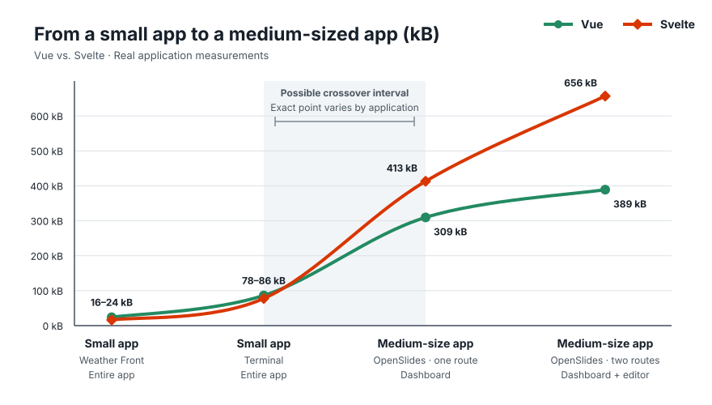
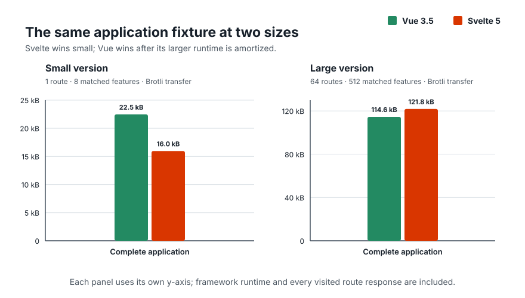

# Vue–Svelte Size Analysis, Revisited for 2026

## TL;DR

- Svelte is the likely bundle-size winner for Hello World demos, isolated
  widgets, and small initial routes.
- Vue can become smaller as an application grows. Svelte is 7.865 kB smaller
  in the controlled small Weather Front application. After loading the
  dashboard and editor in route-split OpenSlides, Vue is 267.736 kB smaller.



*Weather Front is a separate, normalized Vue 3.5/Svelte 5 application. The
middle and final markers are cumulative OpenSlides route states. Each curve
passes through the three measured production states. The dashed vertical line
marks their interpolated crossover; it is an approximation between these
applications, not a universal threshold.*

Here, “small” and “medium-sized” describe product scope rather than universal
line-count thresholds. The normalized Weather Front implementations each have
six component files and 532–584 source lines.
OpenSlides has a dashboard, editor, presentation flow, persistence, search,
settings, and autoplay; its matched implementations contain 27 Vue components
across 8,771 source lines and 99 Svelte components across 18,762 source lines.
Frameworks organize code differently, so those counts provide context rather
than a one-to-one measure of application size.

## Why this benchmark exists

In paraphrase, Svelte advocates argue the following:

- “Svelte avoids the upfront cost of a large framework runtime by compiling
  components into tiny standalone modules.” — Rich Harris, Svelte creator, now
  at Vercel,
  ([*Frameworks without the
  framework*](https://web.archive.org/web/20260727134238/https://svelte.dev/blog/frameworks-without-the-framework))
- “Svelte began as an experiment in making JavaScript bundles as small and fast
  as possible, based on the belief that compiler magic could remove the need to
  worry about shipping too much JavaScript.” — Rich Harris, Svelte creator, now
  at Vercel,
  ([*The Undefined: Vue vs. Svelte with Evan You and Rich Harris*,
  19:10](https://web.archive.org/web/20260727160325/https://undefined.fm/radio/vue-vs-svelte-with-evan-you-and-rich-harris))
- “Moving more framework work into the compiler is what makes Svelte
  applications small and fast.” — The Svelte team, Svelte, ([*Svelte 5 is
  alive*](https://web.archive.org/web/20260727134144/https://svelte.dev/blog/svelte-5-is-alive))
- “The framework largely disappears before the browser loads the page, so
  users receive mostly application code.” — Anshuman Bhardwaj, Vercel,
  ([*What is
  Svelte?*](https://web.archive.org/web/20260727134258/https://vercel.com/i/what-is-svelte))
- “Svelte produces a smaller JavaScript payload than Vue because Vue sends more
  framework logic to the browser.” — Anshuman Bhardwaj, Vercel,
  ([*How Svelte compares with other
  frameworks*](https://web.archive.org/web/20260727134258/https://vercel.com/i/what-is-svelte#how-svelte-compares-with-other-frameworks))
- “Equivalent Svelte bundles are roughly half the size of Vue bundles, and the
  absolute gap remains as applications grow.” — PkgPulse Team, PkgPulse,
  ([*Vue 3 vs. Svelte
  5*](https://web.archive.org/web/20260727134421/https://www.pkgpulse.com/guides/vue-3-vs-svelte-5-2026#bundle-size))
- “A small Vue build can be about ten times larger than its Svelte equivalent.”
  — Arek Nawo, ButterCMS, ([*Svelte vs.
  Vue*](https://web.archive.org/web/20260727134449/https://buttercms.com/blog/svelte-vs-vue-which-one-to-choose/#bundle-size))

## Vue amortization

In this context, amortization means paying a larger shared framework cost once,
then offsetting it by generating less code for each additional component.

In 2021, Vue creator Evan You responded to this underlying claim with
[benchmarks](https://github.com/yyx990803/vue-svelte-size-analysis)
showing that while Svelte had a dramatically smaller framework baseline, Vue
generated substantially less component-specific code for one TodoMVC
component. He then calculated that roughly 19 TodoMVC-sized components could
repay Vue’s larger runtime. That was a model of a larger application, not a
measured complete application containing 19 components.

The architectural tradeoff is also clearly documented in the Vue FAQ:
[https://vuejs.org/about/faq#is-vue-lightweight](https://vuejs.org/about/faq#is-vue-lightweight).

## Is Vue amortization still visible in 2026?

Yes. OpenSlides adds what Evan You’s projection did not measure directly: a
medium-sized application in which Vue becomes substantially smaller after
real routes load. Weather Front establishes the other end honestly: Svelte
still wins in a small application.

## OpenSlides: the primary 2026 case study

I ported the frontend of
[`codewiththiha/OpenSlides`](https://github.com/codewiththiha/OpenSlides), an
MIT-licensed desktop application for building animated code presentations,
from Svelte 5 to Vue 3. The source is pinned at commit
[`a8138eb`](https://github.com/codewiththiha/OpenSlides/tree/a8138eb26c93df378119147c036c34fe7d83b6a7).

OpenSlides is a credible medium-sized application. Its Svelte frontend has 99
components and approximately 18,700 lines of TypeScript, JavaScript, CSS, and
Svelte source. It includes project and slide management, drag-and-drop stacks,
search, syntax highlighting, Magic Move transitions, highlight steps,
presentation mode, autoplay, settings, and a Tauri persistence boundary.

The Vue port uses the same Tauri command contract, Shiki release,
byte-identical Shiki worker, business types, themes, styles, and production
settings. Both implementations lazy-load the dashboard and editor as separate
route chunks. A shared Playwright suite runs the same dashboard, editor,
persistence, grouping, search, settings, presentation, and autoplay behaviors
against both versions. The complete scope is recorded in the
[`parity ledger`](fixtures/openslides/PARITY.md), and the contract itself is
[`tests/openslides-parity.spec.mjs`](tests/openslides-parity.spec.mjs).

### Vue leads after the first user-visible route

A cold production browser first opens the dashboard, then opens the editor.
Vue is smaller at both user-visible stages:

| OpenSlides cold production journey | Vue 3.5 | Svelte 5 | Smaller result |
| --- | ---: | ---: | --- |
| Dashboard, gzip | 418.966 kB | 541.648 kB | Vue by 122.682 kB |
| Dashboard, Brotli | 309.676 kB | 413.089 kB | Vue by 103.413 kB |
| Dashboard through editor, gzip | 510.251 kB | 889.338 kB | Vue by 379.087 kB |
| Dashboard through editor, Brotli | 389.076 kB | 656.812 kB | Vue by 267.736 kB |

Route splitting therefore does not rescue the universal bundle-size claim.
Neither implementation charges the dashboard user for the editor route, yet
Vue is already smaller when that first route becomes usable.

The cold journey includes every production JavaScript, CSS, worker, language,
theme, and Shiki Wasm asset actually requested at each stage. Both
implementations request two Shiki asset sets after the editor opens. These are
real application costs, but they are not pure measurements of framework
runtime bytes.

That distinction matters. OpenSlides proves that a medium-sized Vue
application can be smaller than its behavior-matched Svelte counterpart. It
also shows that the result survives matched route splitting. It does not
establish a universal route number, component count, or source-line threshold
at which every application will cross.

The two implementations are behavior-matched, not line-for-line translations.
Nine shared Playwright workflows—18 passing cases across the two
implementations—cover every material product claim in the parity ledger. Vue
uses 27 larger component files and roughly 8,800 total source lines; Svelte
uses 99 components plus smaller rune and controller modules across roughly
18,800 lines. That difference is part of how the two applications were
credibly authored, but it also means this case study does not isolate runtime
bytes in a laboratory. It proves something narrower and still important: a
serious Vue implementation can be substantially smaller than the Svelte
application it replaces.

The complete requested-file inventory and reproduction command are in
[`openslides.md`](openslides.md).

## Small-app evidence: Weather Front

Alicia Sykes independently built the same weather application in Vue, Svelte,
and eleven other frontend stacks. The implementations share the same
interface, assets, requirements, and Playwright behavior tests.

Weather Front is a small but credible application: one principal screen,
asynchronous data, search, persistence, and loading and error states. It is
well beyond Hello World, but it is not a medium-sized product application.

For the lead graph, I reimplemented its core product surface as a controlled
Vue 3.5/Svelte 5 comparison. Both versions use plain Vite, matched component
responsibilities, byte-identical model code and CSS, and the same Playwright
behavior assertions:

| Controlled Weather Front transfer | Vue 3.5 | Svelte 5 | Smaller result |
| --- | ---: | ---: | --- |
| gzip | 26.353 kB | 18.005 kB | Svelte by 8.348 kB |
| Brotli | 24.003 kB | 16.138 kB | Svelte by 7.865 kB |

Svelte wins this fairer small-application comparison by roughly one-third.
That makes it the useful counterweight to OpenSlides rather than a point chosen
to minimize Svelte’s advantage.

As an external check, the unmodified upstream project also favors Svelte,
although it compares Vue/Vite with Svelte 4/SvelteKit:

| Upstream Weather Front transfer | Vue | Svelte | Smaller result |
| --- | ---: | ---: | --- |
| gzip | 35.281 kB | 34.693 kB | Svelte by 0.588 kB |
| Brotli | 31.423 kB | 30.555 kB | Svelte by 0.868 kB |

The two measurements demonstrate why exact numbers depend on the application
and toolchain even when the broader size curve remains useful.

### Independent terminal-app control

An [independent current comparison](https://github.com/naufalafif/realworld-js-framework-comparison/tree/2c338de860222deba6b842260cfbec6609c272bd)
reports a terminal application at 99.6 KiB for Vue and 87.4 KiB for Svelte. I
reproduced the result, but a vendor split showed that 76.088 kB gzip of both
builds is byte-identical xterm code.
The default framework-plus-application layer is 25.566 kB for Vue and
13.131 kB for Svelte; disabling Vue’s unused Options API reduces Vue to
22.331 kB.

This is legitimate additional evidence for Svelte’s small-application
advantage. It is not evidence that Svelte remains smaller after accumulating
100 kB of framework-generated application code. The detailed reproduction,
source audit, and Brotli measurements are in the
[`independent comparison audit`](docs/ai-research/20260727-realworld-comparison-audit/findings.md).

The complete measurements are in
[`weather-upstream.md`](weather-upstream.md) and
[`weather-staged.md`](weather-staged.md). The source application is
[`lissy93/framework-benchmarks`](https://github.com/lissy93/framework-benchmarks).

## Controlled application-scaling simulation

The route-split application simulation is a generated, browser-runnable
stress test. It is not presented as a real 64-route product. Its purpose is to
hold the feature families constant while repeatedly adding independently
loaded application code.

With one route and eight component definitions, Svelte is smaller. After the
simulation expands to 64 generated route chunks and 512 component definitions,
Vue is smaller. Both measurements include the framework runtime and every
route response loaded during a complete traversal.

| Complete application transfer | Vue 3.5 | Svelte 5 | Smaller result |
| --- | ---: | ---: | --- |
| 1 route, 8 component definitions | 22.463 kB | 15.954 kB | Svelte by 6.509 kB |
| 64 routes, 512 component definitions | 114.570 kB | 121.849 kB | Vue by 7.279 kB |



*Each panel uses its own y-axis. These are two measured builds, not a claim that
real applications contain 64 routes or cross at the same point. The
[complete scaling chart](docs/images/route-split-brotli.svg) shows the
intermediate builds and estimated crossover.*

Both charts use the Composition-only production profile: Vue’s unused Options
API is disabled and Svelte’s version disclosure is disabled. With both
frameworks on their official plugin defaults, Vue still becomes smaller at 64
routes—by 4.498 kB instead of 7.279 kB.

## Updated packages for the 2026 benchmark

- Vue 3.5.40
- Svelte 5.56.8
- Vite 8.1.5
- `@vitejs/plugin-vue` 6.0.8
- `@sveltejs/vite-plugin-svelte` 7.2.0
- Node.js 22.19.0

The newly authored Svelte fixtures use idiomatic Svelte 5 and follow
[Svelte’s documented best
practices](https://svelte.dev/docs/svelte/best-practices). The historical
replication separately preserves Evan You’s original sources.

## New statistics for the 2026 benchmark

- Component-only output and complete production bundles
- Raw, gzip, and Brotli sizes
- CSR, hydration, and SSR output
- Initial-route, lazy-route, and complete-traversal transfer
- Marginal bytes per component and estimated crossover points
- Generated scaling workloads and independently authored application controls
- Default and app-informed trimmed production profiles

The historical reproduction lives in
[`original-specimen.md`](original-specimen.md). The extended interpretation and
limitations live in [`analysis.md`](analysis.md). The exact workloads, controls,
and transfer model live in [`METHODOLOGY.md`](METHODOLOGY.md).

## Run the benchmarks

Requirements:

- Node.js 22.19.0 (also recorded in `.nvmrc`)
- npm
- network access for the two commit-pinned upstream specimen lanes
- Chromium for the OpenSlides browser-transfer benchmark and behavior-parity
  tests

Install exactly the locked dependency graph:

```bash
npm ci
```

Run every benchmark lane:

```bash
npm run benchmark:all
npm run verify
```

Run one lane:

```bash
npm run benchmark:original
npm run benchmark
npm run benchmark:route-split
npm run benchmark:matched-app
npm run benchmark:hand-authored
npm run benchmark:optimization-sensitivity
npm run benchmark:weather-upstream
npm run benchmark:weather-staged
npm run benchmark:openslides
```

Generate the committed charts:

```bash
npm run charts
```

Run the shared behavior contracts:

```bash
npx playwright install chromium
npm test
npm run test:weather-parity
npm run test:openslides-parity
```

Playwright runs headlessly against both complete fixtures and performs the same
interactions so that unlike behavior cannot be rewarded with a smaller result.
The browser and test code are development-only dependencies and never enter a
measured bundle.

## License

The benchmark harness and original fixtures in this repository are available
under the [MIT License](LICENSE). The committed OpenSlides specimen and Vue
port retain the upstream project’s
[MIT license](fixtures/openslides/svelte/LICENSE). Other fetched upstream
specimens retain their respective licenses and are not committed here.
