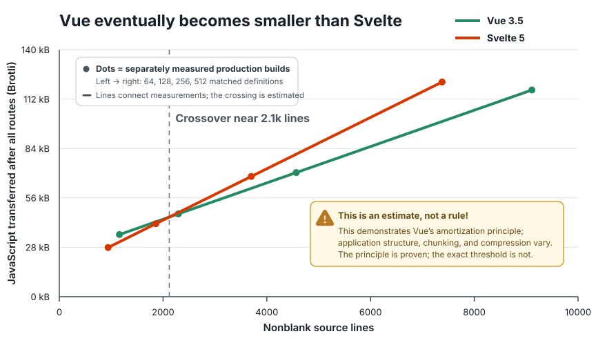

# Vue–Svelte Bundle Scaling, Revisited

## TL;DR

- Svelte is the likely bundle-size winner for Hello World demos, isolated
  widgets, and small initial routes.
- Vue is likely to be smaller for medium-to-large applications, especially when
  users load many routes.



## Why this benchmark exists

In paraphrase, Svelte advocates argue:

- “Svelte avoids the upfront cost of a large framework runtime by compiling
  components into tiny standalone modules.” ([Svelte:
  *Frameworks without the
  framework*](https://web.archive.org/web/20260727134238/https://svelte.dev/blog/frameworks-without-the-framework))
- “Moving more framework work into the compiler is what makes Svelte
  applications small and fast.” ([Svelte:
  *Svelte 5 is
  alive*](https://web.archive.org/web/20260727134144/https://svelte.dev/blog/svelte-5-is-alive))
- “The framework largely disappears before the browser loads the page, so
  users receive mostly application code.” ([Vercel:
  *What is
  Svelte?*](https://web.archive.org/web/20260727134258/https://vercel.com/i/what-is-svelte))
- “Svelte produces a smaller JavaScript payload than Vue because Vue sends more
  framework logic to the browser.” ([Vercel:
  *How Svelte compares with other
  frameworks*](https://web.archive.org/web/20260727134258/https://vercel.com/i/what-is-svelte#how-svelte-compares-with-other-frameworks))
- “Equivalent Svelte bundles are roughly half the size of Vue bundles, and the
  absolute gap remains as applications grow.” ([PkgPulse:
  *Vue 3 vs. Svelte
  5*](https://web.archive.org/web/20260727134421/https://www.pkgpulse.com/guides/vue-3-vs-svelte-5-2026#bundle-size))
- “A small Vue build can be about ten times larger than its Svelte equivalent.”
  ([ButterCMS:
  *Svelte vs.
  Vue*](https://web.archive.org/web/20260727134449/https://buttercms.com/blog/svelte-vs-vue-which-one-to-choose/#bundle-size))

## Vue amortization

In 2021, Vue creator Evan You responded to these claims with a
[comparison](https://github.com/yyx990803/vue-svelte-size-analysis/blob/7bb60ff681a3f5016e8af26084e72100cd37a876/README.md#analysis)
showing that while Svelte had a dramatically smaller framework baseline, Vue
was designed around amortization: Vue paid more upfront but generated
substantially less component code. Given enough components and application
code, that lower marginal cost could repay the larger baseline. He concluded
that Svelte provided a compelling advantage for isolated components, but that
its generated-code cost could become a disadvantage for medium-to-large
applications. This is also clearly documented in the Vue FAQ:
[https://vuejs.org/about/faq#is-vue-lightweight](https://web.archive.org/web/20260727134318/https://vuejs.org/about/faq#is-vue-lightweight).

Evan’s specimen was TodoMVC, a tiny application rather than a large product.
Even at that scale, Vue was already generating less component-specific code
than Svelte. That does not mean the complete Vue bundle was smaller—Svelte’s
much smaller runtime still kept its total ahead. It means Vue’s amortization
had already begun: every additional component could continue paying down its
larger shared baseline.

## Is this still true in 2026?

Yes. We put together this updated example to build on and expand Evan You’s
original comparison five years later, using a current toolchain and broader
benchmarks.

## Updated packages for the 2026 benchmark

- Vue 3.5.40
- Svelte 5.56.8
- Vite 8.1.5
- `@vitejs/plugin-vue` 6.0.8
- `@sveltejs/vite-plugin-svelte` 7.2.0
- Node.js 22.19.0

The current Svelte implementation is idiomatic Svelte 5 and follows
[Svelte’s documented best
practices](https://svelte.dev/docs/svelte/best-practices).

## New statistics for the 2026 benchmark

- Component-only output and complete production bundles
- Raw, gzip, and Brotli sizes
- CSR, hydration, and SSR output
- Initial-route, lazy-route, and complete-traversal transfer
- Marginal bytes per component and estimated crossover points
- Generated scaling workloads and independently authored application controls
- Default and app-informed trimmed production profiles

The extended interpretation and limitations live in
[`analysis.md`](analysis.md). The exact workloads, controls, and transfer model
live in [`METHODOLOGY.md`](METHODOLOGY.md).

## Run the benchmarks

Requirements:

- Node.js 22.19.0 (also recorded in `.nvmrc`)
- npm
- network access for the two commit-pinned upstream specimen lanes
- Chromium only if running the optional behavior-parity test

Install exactly the locked dependency graph:

```bash
npm ci
```

Run every benchmark lane:

```bash
npm run benchmark:all
npm run verify
```

Run one lane:

```bash
npm run benchmark:original
npm run benchmark
npm run benchmark:route-split
npm run benchmark:matched-app
npm run benchmark:hand-authored
npm run benchmark:optimization-sensitivity
```

Generate the committed charts:

```bash
npm run charts
```

Run the small product-shaped application’s behavior contract:

```bash
npx playwright install chromium
npm test
```

Chromium is not used to compile, minify, compress, or measure bundles.
Playwright opens both complete fixtures and performs the same interactions so
that unlike behavior cannot be rewarded with a smaller result. The browser and
test code are development-only dependencies and never enter a measured bundle.

## Repository map

| Path | Purpose |
| --- | --- |
| [`METHODOLOGY.md`](METHODOLOGY.md) | Benchmark questions, controls, compression model, equivalence rules, and limitations |
| [`analysis.md`](analysis.md) | Evidence-backed interpretation of all five lanes |
| [`results.json`](results.json) / [`results.md`](results.md) | Controlled 0–640-definition matrix |
| [`original-specimen.json`](original-specimen.json) / [`original-specimen.md`](original-specimen.md) | Current compilation of the exact 2021 specimen |
| [`route-split.json`](route-split.json) / [`route-split.md`](route-split.md) | Generated route-split scaling curve |
| [`matched-app.json`](matched-app.json) / [`matched-app.md`](matched-app.md) | Commit-pinned external matched application |
| [`hand-authored.json`](hand-authored.json) / [`hand-authored.md`](hand-authored.md) | Independently authored 8-route application |
| [`route-split-trimmed.json`](route-split-trimmed.json) / [`route-split-trimmed.md`](route-split-trimmed.md) | Route-split sensitivity with unused framework features disabled |
| [`hand-authored-trimmed.json`](hand-authored-trimmed.json) / [`hand-authored-trimmed.md`](hand-authored-trimmed.md) | Hand-authored sensitivity with unused framework features disabled |
| [`fixtures/hand-authored/SPEC.md`](fixtures/hand-authored/SPEC.md) | Framework-neutral behavior contract fixed before measurement |
| [`tests/hand-authored-parity.spec.mjs`](tests/hand-authored-parity.spec.mjs) | Identical Playwright assertions against Vue and Svelte |
| [`results-lock.json`](results-lock.json) | Cross-platform normalized SHA-256 hashes for generated JSON |
| [`docs/research/source-ledger.md`](docs/research/source-ledger.md) | Primary-source and provenance ledger |

## Provenance

- Evan You’s [original analysis and source
  specimen](https://github.com/yyx990803/vue-svelte-size-analysis/tree/7bb60ff681a3f5016e8af26084e72100cd37a876)
  are pinned at commit `7bb60ff681a3f5016e8af26084e72100cd37a876`.
- The matched Vue and Svelte applications come from
  [`js-framework-benchmark`](https://github.com/krausest/js-framework-benchmark/tree/6bd71fcab935b7e4c627b7c394a86633fcd8feea)
  at commit `6bd71fcab935b7e4c627b7c394a86633fcd8feea`,
  under Apache-2.0.
- Framework and tool versions are exact, not semver ranges.
- Generated JSON records SHA-256 digests for every downloaded source file.
- Mutable web claims link to dated Wayback snapshots; GitHub evidence links to
  exact commits. The [source ledger](docs/research/source-ledger.md) preserves
  both the live and immutable locations.
- Generated work directories are deleted by default. Set
  `KEEP_BENCH_WORK=1` for the controlled lane when inspecting compiler output.

## License

The benchmark harness and original fixtures in this repository are available
under the [MIT License](LICENSE). Fetched upstream specimens retain their
respective upstream licenses and are not committed here.
