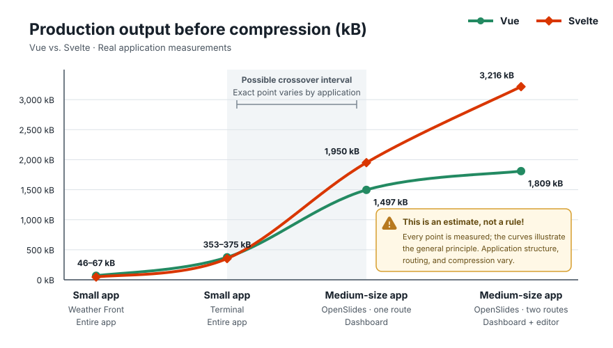

# Vue–Svelte Size Analysis, Revisited for 2026

## TL;DR

- Svelte is the smaller bundle size for Hello World demos, isolated widgets,
  and small-to-medium applications.
- Vue is the smaller bundle size for medium-to-large applications.


## Why this benchmark exists

In paraphrase, Svelte advocates argue the following:

- “Svelte avoids the upfront cost of a large framework runtime by compiling
  components into tiny standalone modules.” — Rich Harris, Svelte creator, now
  at Vercel,
  ([*Frameworks without the
  framework*](https://web.archive.org/web/20260727134238/https://svelte.dev/blog/frameworks-without-the-framework))
- “Svelte began as an experiment in making JavaScript bundles as small and fast
  as possible, based on the belief that compiler magic could remove the need to
  worry about shipping too much JavaScript.” — Rich Harris, Svelte creator, now
  at Vercel,
  ([*The Undefined: Vue vs. Svelte with Evan You and Rich Harris*,
  19:10](https://web.archive.org/web/20260727160325/https://undefined.fm/radio/vue-vs-svelte-with-evan-you-and-rich-harris))
- “Moving more framework work into the compiler is what makes Svelte
  applications small and fast.” — The Svelte team, Svelte, ([*Svelte 5 is
  alive*](https://web.archive.org/web/20260727134144/https://svelte.dev/blog/svelte-5-is-alive))
- “The framework largely disappears before the browser loads the page, so
  users receive mostly application code.” — Anshuman Bhardwaj, Vercel,
  ([*What is
  Svelte?*](https://web.archive.org/web/20260727134258/https://vercel.com/i/what-is-svelte))
- “Svelte produces a smaller JavaScript payload than Vue because Vue sends more
  framework logic to the browser.” — Anshuman Bhardwaj, Vercel,
  ([*How Svelte compares with other
  frameworks*](https://web.archive.org/web/20260727134258/https://vercel.com/i/what-is-svelte#how-svelte-compares-with-other-frameworks))
- “Equivalent Svelte bundles are roughly half the size of Vue bundles, and the
  absolute gap remains as applications grow.” — PkgPulse Team, PkgPulse,
  ([*Vue 3 vs. Svelte
  5*](https://web.archive.org/web/20260727134421/https://www.pkgpulse.com/guides/vue-3-vs-svelte-5-2026#bundle-size))
- “A small Vue build can be about ten times larger than its Svelte equivalent.”
  — Arek Nawo, ButterCMS, ([*Svelte vs.
  Vue*](https://web.archive.org/web/20260727134449/https://buttercms.com/blog/svelte-vs-vue-which-one-to-choose/#bundle-size))
- “In practice, you're unlikely to hit that inflection point on any given page
  of your app, as long as you're using code-splitting.” — Rich Harris, Svelte
  creator, now at Vercel,
  ([*Yes but does it
  scale?*](https://github.com/sveltejs/svelte/issues/2546))

## Vue’s bundle-size crossover

Vue pays more upfront for its shared runtime. If each additional Vue component
contributes less generated code than its Svelte counterpart, enough components
eventually repay that initial difference. The point at which Vue becomes
smaller is the bundle-size crossover.

In 2021, Vue creator Evan You responded to this underlying claim with
[benchmarks](https://github.com/yyx990803/vue-svelte-size-analysis)
showing that while Svelte had a dramatically smaller framework baseline, Vue
generated substantially less component-specific code for one TodoMVC
component. He then calculated that roughly 19 TodoMVC-sized components could
repay Vue’s larger runtime. That was a model of a larger application, not a
measured complete application containing 19 components.

The architectural tradeoff is also clearly documented in the Vue FAQ:
[https://vuejs.org/about/faq#is-vue-lightweight](https://vuejs.org/about/faq#is-vue-lightweight).

## Is Vue’s bundle-size crossover still visible in 2026?

> “[...Svelte 5 makes this entire question
> outdated.](https://github.com/sveltejs/svelte/issues/2546#issuecomment-2030790447)”
> — Rich Harris

Using an existing Svelte 5 application and a corresponding Vue application,
the benchmark finds Vue smaller in both code-split usage patterns: after
visiting all benchmarked routes and after loading only the default route.

## Updated packages for the 2026 benchmark

- Vue 3.5.40
- Svelte 5.56.8
- Vite 8.1.5
- `@vitejs/plugin-vue` 6.0.8
- `@sveltejs/vite-plugin-svelte` 7.2.0
- Node.js 22.19.0

The newly authored Svelte fixtures use idiomatic Svelte 5 and follow
[Svelte’s documented best
practices](https://svelte.dev/docs/svelte/best-practices). The historical
replication separately preserves Evan You’s original sources.

## New statistics for the 2026 benchmark

- Component-only output and complete production bundles
- Raw, gzip, and Brotli sizes
- CSR, hydration, and SSR output
- Initial-route, lazy-route, and complete-traversal transfer
- Marginal bytes per component and estimated crossover ranges
- Generated scaling workloads and independently authored application controls
- Default and app-informed trimmed production profiles

Reproduction commands begin at
[`Run the benchmarks`](#run-the-benchmarks).

## Vue wins in medium-to-large applications

OpenSlides is a working, MIT-licensed desktop application for building
animated code presentations. I ported its frontend from Svelte 5 to Vue 3 to
demonstrate Evan You’s projected crossover in a substantial application. The
upstream source is pinned at commit
[`a8138eb`](https://github.com/codewiththiha/OpenSlides/tree/a8138eb26c93df378119147c036c34fe7d83b6a7).

Both versions lazy-load the same dashboard and editor routes and pass the same
nine Playwright workflows.

| OpenSlides production transfer | Vue 3.5 | Svelte 5 | Smaller result |
| --- | ---: | ---: | --- |
| Dashboard, gzip | 418.966 kB | 541.648 kB | Vue by 122.682 kB |
| Dashboard, Brotli | 309.676 kB | 413.089 kB | Vue by 103.413 kB |
| Dashboard through editor, gzip | 510.251 kB | 889.338 kB | Vue by 379.087 kB |
| Dashboard through editor, Brotli | 389.076 kB | 656.812 kB | Vue by 267.736 kB |

Vue is already 103.413 kB smaller when the dashboard becomes usable and
267.736 kB smaller after the editor loads.

The final Svelte journey requests a second Shiki engine, language, and theme
set totaling 174.992 kB after Brotli. That implementation detail increases the
final gap. Removing it as a sensitivity check still leaves Vue 92.744 kB
smaller, while the dashboard result is unaffected and already favors Vue by
103.413 kB.

### Compression does not create Vue’s lead

The difference also exists before transfer compression:



*At the final state, Vue emits 1.810 MB and Svelte emits 3.216 MB before
compression. The result comes from the production output, not from Brotli
compressing Vue more efficiently.*

These measurements include every production asset requested by each working
application. They compare complete application transfer rather than isolated
framework-runtime bytes and do not claim a universal crossover threshold.

See the [`parity ledger`](fixtures/openslides/PARITY.md), [shared Playwright
contract](tests/openslides-parity.spec.mjs), and
[`complete results`](results/openslides.md).

## Svelte wins in small-to-medium applications

Svelte wins both small applications measured in the lead chart:

| Brotli transfer | Vue 3.5 | Svelte 5 | Smaller result |
| --- | ---: | ---: | --- |
| Weather Front | 24.003 kB | 16.138 kB | Svelte by 7.865 kB |
| Terminal | 86.265 kB | 77.671 kB | Svelte by 8.594 kB |

Weather Front uses matched Vue and Svelte implementations of the same product
surface. Terminal reproduces an
[independent comparison](https://github.com/naufalafif/realworld-js-framework-comparison/tree/2c338de860222deba6b842260cfbec6609c272bd).
Together they establish the left side of the chart: Svelte starts smaller.

Synthetic scaling tests, the historical TodoMVC reproduction, complete
small-app measurements, and every machine-readable artifact are indexed in
[`results/`](results/README.md). Interpretation and limitations live in
[`docs/analysis.md`](docs/analysis.md); the transfer model is documented in
[`METHODOLOGY.md`](METHODOLOGY.md).

## Run the benchmarks

Requirements:

- Node.js 22.19.0 (also recorded in `.nvmrc`)
- npm
- network access for the two commit-pinned upstream specimen lanes
- Chromium for the OpenSlides browser-transfer benchmark and behavior-parity
  tests

Install exactly the locked dependency graph:

```bash
npm ci
npx playwright install chromium
```

Run the complete benchmark and validation suite:

```bash
npm run benchmark:all
npm test
npm run verify
```

Narrower benchmark, test, reporting, and chart commands are listed in
[`package.json`](package.json).

## License

The benchmark harness and original fixtures in this repository are available
under the [MIT License](LICENSE). The committed OpenSlides specimen and Vue
port retain the upstream project’s
[MIT license](fixtures/openslides/svelte/LICENSE). Other fetched upstream
specimens retain their respective licenses and are not committed here.
