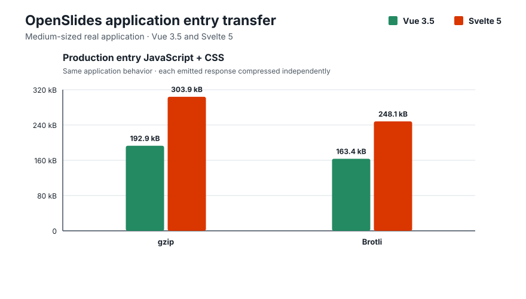

# Vue–Svelte Size Analysis, Revisited for 2026

## TL;DR

- Svelte is the likely bundle-size winner for Hello World demos, isolated
  widgets, and small initial routes.
- Vue can become smaller as an application grows. In the medium-sized
  OpenSlides case study, Vue’s entry JavaScript and CSS are 84.728 kB smaller
  with Brotli.



*This is a measured production build of a real application, not a projection.
The shared Playwright contract runs the same behaviors against both
implementations before either bundle is measured.*

## Why this benchmark exists

In paraphrase, Svelte advocates argue the following:

- “Svelte avoids the upfront cost of a large framework runtime by compiling
  components into tiny standalone modules.” — Rich Harris, Svelte creator, now
  at Vercel,
  ([*Frameworks without the
  framework*](https://web.archive.org/web/20260727134238/https://svelte.dev/blog/frameworks-without-the-framework))
- “Svelte began as an experiment in making JavaScript bundles as small and fast
  as possible, based on the belief that compiler magic could remove the need to
  worry about shipping too much JavaScript.” — Rich Harris, Svelte creator, now
  at Vercel,
  ([*The Undefined: Vue vs. Svelte with Evan You and Rich Harris*,
  19:10](https://web.archive.org/web/20260727160325/https://undefined.fm/radio/vue-vs-svelte-with-evan-you-and-rich-harris))
- “Moving more framework work into the compiler is what makes Svelte
  applications small and fast.” — The Svelte team, Svelte, ([*Svelte 5 is
  alive*](https://web.archive.org/web/20260727134144/https://svelte.dev/blog/svelte-5-is-alive))
- “The framework largely disappears before the browser loads the page, so
  users receive mostly application code.” — Anshuman Bhardwaj, Vercel,
  ([*What is
  Svelte?*](https://web.archive.org/web/20260727134258/https://vercel.com/i/what-is-svelte))
- “Svelte produces a smaller JavaScript payload than Vue because Vue sends more
  framework logic to the browser.” — Anshuman Bhardwaj, Vercel,
  ([*How Svelte compares with other
  frameworks*](https://web.archive.org/web/20260727134258/https://vercel.com/i/what-is-svelte#how-svelte-compares-with-other-frameworks))
- “Equivalent Svelte bundles are roughly half the size of Vue bundles, and the
  absolute gap remains as applications grow.” — PkgPulse Team, PkgPulse,
  ([*Vue 3 vs. Svelte
  5*](https://web.archive.org/web/20260727134421/https://www.pkgpulse.com/guides/vue-3-vs-svelte-5-2026#bundle-size))
- “A small Vue build can be about ten times larger than its Svelte equivalent.”
  — Arek Nawo, ButterCMS, ([*Svelte vs.
  Vue*](https://web.archive.org/web/20260727134449/https://buttercms.com/blog/svelte-vs-vue-which-one-to-choose/#bundle-size))

## Vue amortization

In this context, amortization means paying a larger shared framework cost once,
then offsetting it by generating less code for each additional component.

In 2021, Vue creator Evan You responded to this underlying claim with
[benchmarks](https://github.com/yyx990803/vue-svelte-size-analysis)
showing that while Svelte had a dramatically smaller framework baseline, Vue
generated substantially less component-specific code for one TodoMVC
component. He then calculated that roughly 19 TodoMVC-sized components could
repay Vue’s larger runtime. That was a model of a larger application, not a
measured complete application containing 19 components.

The architectural tradeoff is also clearly documented in the Vue FAQ:
[https://vuejs.org/about/faq#is-vue-lightweight](https://vuejs.org/about/faq#is-vue-lightweight).

## A small real application supplies a reality check

Alicia Sykes built the same weather application in Vue, Svelte, and eleven
other frontend stacks specifically to compare them. The implementations share
the same interface, assets, requirements, and Playwright behavior tests.

Weather Front is a small but credible application: one principal screen, eight
Vue component definitions, roughly 750–900 lines of application source
depending on the implementation, asynchronous data, search, persistence, and
loading and error states. It is substantially more representative than Hello
World, but it is not a medium-sized product application.

[](https://github.com/lissy93/framework-benchmarks)

*Weather Front by [Alicia Sykes](https://aliciasykes.com), from the
MIT-licensed
[`lissy93/framework-benchmarks`](https://github.com/lissy93/framework-benchmarks)
project. Explore the [Vue
source](https://github.com/lissy93/framework-benchmarks/tree/53862d6eac22af7aca571ca11af25559059e2f14/apps/vue),
the [Svelte
source](https://github.com/lissy93/framework-benchmarks/tree/53862d6eac22af7aca571ca11af25559059e2f14/apps/svelte),
and the [published comparison](https://framework-benchmarks.as93.net/).*

The upstream report inventories emitted files and reports Vue as smaller. That
inventory includes an unrequested duplicate Svelte CSS artifact while omitting
Vue’s separately served shared CSS. I therefore repeated the comparison by
measuring only JavaScript and CSS responses requested during a cold production
load:

| Weather Front requested transfer | Vue | Svelte | Smaller result |
| --- | ---: | ---: | --- |
| gzip | 35.281 kB | 34.693 kB | Svelte by 0.588 kB |
| Brotli | 31.423 kB | 30.555 kB | Svelte by 0.868 kB |

This is not a crossover. It is the honest small-application starting point:
Svelte remains smaller, but its transfer advantage is already below one
kilobyte in this independently authored app. The upstream project compares
Vue/Vite with Svelte 4/SvelteKit, so the result is preserved separately from
this repository’s normalized Vue 3/Svelte 5 lanes. The complete per-response
measurement and reproduction command are in
[`weather-upstream.md`](weather-upstream.md).

I then rebuilt the same core product surface with current, matched boundaries:
Vue 3.5 and Svelte 5 use plain Vite, import byte-identical business logic and
CSS, expose the same component boundaries, and pass the same Playwright
behavior contract.

| Normalized core Weather application | Vue | Svelte | Smaller result |
| --- | ---: | ---: | --- |
| gzip | 26.353 kB | 18.005 kB | Svelte by 8.348 kB |
| Brotli | 24.003 kB | 16.138 kB | Svelte by 7.865 kB |

The normalized result is less favorable to Vue than the upstream near-tie.
That matters: the near-tie was partly a consequence of comparing a plain Vue
SPA with a SvelteKit application, not evidence that this small product had
nearly repaid Vue’s runtime. The complete current-toolchain result and
reproduction command are in [`weather-staged.md`](weather-staged.md); the
shared contract is in
[`tests/weather-staged-parity.spec.mjs`](tests/weather-staged-parity.spec.mjs).

## A medium-sized real application makes the crossover concrete

The generated scaling fixtures answer a narrow architectural question, but a
real application is harder to dismiss. I therefore ported the frontend of
[`codewiththiha/OpenSlides`](https://github.com/codewiththiha/OpenSlides), an
MIT-licensed desktop application for building animated code presentations,
from Svelte 5 to Vue 3. The source is pinned at commit
[`a8138eb`](https://github.com/codewiththiha/OpenSlides/tree/a8138eb26c93df378119147c036c34fe7d83b6a7).

OpenSlides is a credible medium-sized application. Its Svelte frontend has 99
components and approximately 18,700 lines of TypeScript, JavaScript, CSS, and
Svelte source. It includes project and slide management, drag-and-drop stacks,
search, syntax highlighting, Magic Move transitions, highlight steps,
presentation mode, autoplay, settings, and a Tauri persistence boundary.

The Vue port uses the same Tauri command contract, Shiki release, byte-identical
Shiki worker, business types, themes, styles, and production settings. A shared
Playwright suite runs the same dashboard, editor, persistence, grouping,
search, settings, presentation, and autoplay behaviors against both versions.
The complete scope is recorded in the
[`parity ledger`](fixtures/openslides/PARITY.md), and the contract itself is
[`tests/openslides-parity.spec.mjs`](tests/openslides-parity.spec.mjs).

| OpenSlides entry JavaScript + CSS | Vue 3.5 | Svelte 5 | Smaller result |
| --- | ---: | ---: | --- |
| gzip | 192.863 kB | 303.906 kB | Vue by 111.043 kB |
| Brotli | 163.396 kB | 248.124 kB | Vue by 84.728 kB |

This is the direct rebuttal to the universal bundle-size claim. Svelte’s
smaller framework baseline does not guarantee a smaller substantial
application. In this real application, the Vue entry is decisively smaller
under both compression formats.

I also measured the static assets requested by a cold production browser,
rather than stopping at the Vite manifest:

| OpenSlides cold production journey | Vue 3.5 | Svelte 5 | Smaller result |
| --- | ---: | ---: | --- |
| Dashboard, Brotli | 338.033 kB | 465.447 kB | Vue by 127.414 kB |
| Dashboard through editor, Brotli | 543.247 kB | 640.079 kB | Vue by 96.832 kB |

The cold editor journey includes Shiki worker, language, theme, and Wasm
assets requested by the two applications. Both implementations request two
Shiki asset sets during this journey. Those assets are real application costs,
but the entry JavaScript-and-CSS table remains the cleaner
framework-and-application comparison.

The two implementations are behavior-matched, not line-for-line translations.
Nine shared Playwright workflows—18 passing cases across the two
implementations—cover every material product claim in the parity ledger. Vue
uses 27 larger component files and roughly 8,800 total source lines; Svelte
uses 99 components plus smaller rune and controller modules across roughly
18,800 lines. That difference is part of how the two applications were
credibly authored, but it also means this case study does not isolate runtime
bytes in a laboratory. It proves something narrower and still important: a
serious Vue implementation can be substantially smaller than the Svelte
application it replaces.

The complete requested-file inventory and reproduction command are in
[`openslides.md`](openslides.md).

## Is this still true in 2026?

Yes. The OpenSlides case study provides a measured medium-sized application,
and the route-split simulation independently demonstrates the underlying
scaling curve with controlled generated workloads.

## Route-split application simulation

The route-split application simulation is a generated, browser-runnable
benchmark. It is the central application in this study. Its shell lazily loads
routes, each containing one counter, disclosure, tabs panel, task tracker,
search panel, settings form, pagination control, and notification panel.

The clearest comparison is the same simulation at two sizes. With one route
and eight component definitions, Svelte is smaller. After the
simulation expands to 64 routes and 512 component definitions, Vue is
smaller. Both measurements include the framework runtime and every route
response loaded during a complete traversal.

| Complete application transfer | Vue 3.5 | Svelte 5 | Smaller result |
| --- | ---: | ---: | --- |
| 1 route, 8 component definitions | 22.463 kB | 15.954 kB | Svelte by 6.509 kB |
| 64 routes, 512 component definitions | 114.570 kB | 121.849 kB | Vue by 7.279 kB |


*Each panel uses its own y-axis. These are two measured builds, not a claim that
every application crosses at the same point. The
[complete scaling chart](docs/images/route-split-brotli.svg) shows the
intermediate builds and estimated crossover.*

Both charts use the Composition-only production profile: Vue’s unused Options
API is disabled and Svelte’s version disclosure is disabled. With both
frameworks on their official plugin defaults, Vue still becomes smaller at 64
routes—by 4.498 kB instead of 7.279 kB.

## Updated packages for the 2026 benchmark

- Vue 3.5.40
- Svelte 5.56.8
- Vite 8.1.5
- `@vitejs/plugin-vue` 6.0.8
- `@sveltejs/vite-plugin-svelte` 7.2.0
- Node.js 22.19.0

The newly authored Svelte fixtures use idiomatic Svelte 5 and follow
[Svelte’s documented best
practices](https://svelte.dev/docs/svelte/best-practices). The historical
replication separately preserves Evan You’s original sources.

## New statistics for the 2026 benchmark

- Component-only output and complete production bundles
- Raw, gzip, and Brotli sizes
- CSR, hydration, and SSR output
- Initial-route, lazy-route, and complete-traversal transfer
- Marginal bytes per component and estimated crossover points
- Generated scaling workloads and independently authored application controls
- Default and app-informed trimmed production profiles

The historical reproduction lives in
[`original-specimen.md`](original-specimen.md). The extended interpretation and
limitations live in [`analysis.md`](analysis.md). The exact workloads, controls,
and transfer model live in [`METHODOLOGY.md`](METHODOLOGY.md).

## Run the benchmarks

Requirements:

- Node.js 22.19.0 (also recorded in `.nvmrc`)
- npm
- network access for the two commit-pinned upstream specimen lanes
- Chromium for the OpenSlides browser-transfer benchmark and behavior-parity
  tests

Install exactly the locked dependency graph:

```bash
npm ci
```

Run every benchmark lane:

```bash
npm run benchmark:all
npm run verify
```

Run one lane:

```bash
npm run benchmark:original
npm run benchmark
npm run benchmark:route-split
npm run benchmark:matched-app
npm run benchmark:hand-authored
npm run benchmark:optimization-sensitivity
npm run benchmark:weather-upstream
npm run benchmark:weather-staged
npm run benchmark:openslides
```

Generate the committed charts:

```bash
npm run charts
```

Run the shared behavior contracts:

```bash
npx playwright install chromium
npm test
npm run test:weather-parity
npm run test:openslides-parity
```

Playwright runs headlessly against both complete fixtures and performs the same
interactions so that unlike behavior cannot be rewarded with a smaller result.
The browser and test code are development-only dependencies and never enter a
measured bundle.

## License

The benchmark harness and original fixtures in this repository are available
under the [MIT License](LICENSE). The committed OpenSlides specimen and Vue
port retain the upstream project’s
[MIT license](fixtures/openslides/svelte/LICENSE). Other fetched upstream
specimens retain their respective licenses and are not committed here.
