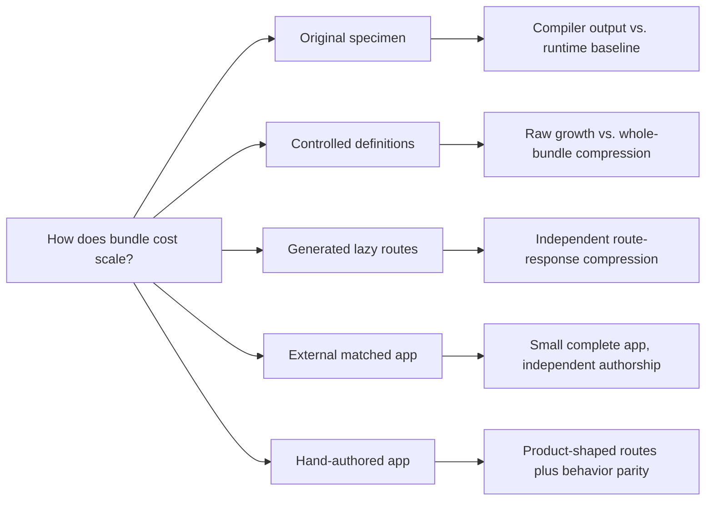

# Vue–Svelte Bundle Scaling, Revisited

This repository reproduces Evan You’s 2021
[`vue-svelte-size-analysis`](https://github.com/yyx990803/vue-svelte-size-analysis)
with Vue 3.5, Svelte 5, and Vite 8, then tests the architectural claim under
five complementary workloads.

## TL;DR

Svelte is the likely bundle-size winner for widgets and small applications.
For medium-to-large applications with many distinct features and independently
transferred routes, these results support Vue as the likely smaller framework
layer.

## Why this benchmark exists

Svelte’s size story is one of the most memorable pitches in frontend
development. Rich Harris introduced Svelte by asking what would happen if the
framework did not run in the browser:

> “You’d pay no upfront cost of shipping a hefty runtime.”
>
> — [Rich Harris, “Frameworks without the framework”](https://svelte.dev/blog/frameworks-without-the-framework)

The current Svelte team preserves the connection between compilation and size:

> “Svelte apps are small and fast.”
>
> — [The Svelte team, “Svelte 5 is alive”](https://svelte.dev/blog/svelte-5-is-alive)

Vercel, Svelte’s corporate backer, states the idea even more literally:

> “The framework itself largely disappears before the browser loads a page.”
>
> — [Vercel, “What is Svelte?”](https://vercel.com/i/what-is-svelte)

And a widely read Svelte comparison made the scaling claim explicit:

> “The scale at which Svelte's advantages disappear is actually unrealistically
> high for just about any application.”
>
> — [Josh Collinsworth, “Introducing Svelte”](https://joshcollinsworth.com/blog/introducing-svelte-comparing-with-react-vue)

Taken together, these statements combine a real advantage with an unjustified
leap. Svelte avoids Vue’s large fixed starting cost, so it predictably wins at
the small end. It does not follow that compiler-generated applications remain
smaller at the medium or large end. The final quote also summarized Svelte
3-era evidence; testing the current architecture is the point of this
repository.

The literal “framework disappears” description is not accurate for Svelte 5.
Its official migration guide says that
[“reactivity is determined at runtime rather than compile time”](https://svelte.dev/docs/svelte/v5-migration-guide).
Svelte 5 combines compiler output with shared signal-based runtime machinery,
just at a different balance from Vue.

Vue’s own size claim is the direct counterargument:

> “While Vue has a heavier baseline size, it generates less code per
> component.”
>
> — [Vue FAQ, “Is Vue lightweight?”](https://vuejs.org/about/faq#is-vue-lightweight)

The architectural model under test is simple:

```text
Vue application    = larger shared baseline + lower marginal component cost
Svelte application = smaller shared baseline + higher marginal component cost
```

If Vue’s marginal cost remains lower, it eventually repays the baseline. The
open questions are whether that difference survives a modern compiler,
whole-application minification, gzip and Brotli, heterogeneous feature code,
and real route boundaries. This repository measures each question separately.

## Results at a glance

| Workload | What is held constant | Result |
| --- | --- | --- |
| Original 2021 TodoMVC source | Same historical component source, current compilers | Vue component-only output was 1,306 B Brotli; Svelte was 1,500 B. Complete Svelte bundles were still 9–10 kB smaller. |
| Controlled scaling | 0–640 distinct generated definitions, complete production builds | Vue crossed in raw client JavaScript near 272–326 components, depending on lane and component shape. No compressed crossover appeared through 640 near-clones. |
| Heterogeneous lazy routes | Eight behavior families per independently compressed route | Vue crossed in this synthetic workload near 241 components with gzip and 339 with Brotli. |
| Independently maintained matched app | Keyed `js-framework-benchmark` implementations | Svelte was 9,919 B smaller with Brotli. |
| Hand-authored product routes | Same 8-route, 33-component behavior contract | Svelte was 7,604 B smaller for a complete cold traversal and 8,400 B smaller initially. The complete gap narrowed as routes were added. |

The third row is an existence proof for Vue’s compressed amortization, not a
forecast that every application crosses at component 339. The final two rows
are equally important: current Svelte remains decisively smaller in the small
complete applications measured here. In the hand-authored application, all
seven lazy route chunks were smaller with Vue after Brotli, yet Svelte's
smaller initial entry kept its complete total ahead at 33 definitions.

## What these benchmarks establish

The results establish the amortization mechanism and support a practical
inference: **as an application accumulates many distinct, independently
transferred features, Vue becomes increasingly likely to erase Svelte’s
initial advantage and become smaller overall.** They do not provide one
crossover boundary for every codebase.

1. **Svelte starts substantially smaller.** It won every complete
   small-application comparison in this repository. For the hand-authored
   application, Svelte’s initial JavaScript was 8,400 B smaller with Brotli.
2. **Vue can add less code as an application grows.** All seven lazy feature
   routes in the hand-authored application were 32–201 B smaller with Vue after
   Brotli. The application did not grow far enough to repay Vue’s larger
   initial entry, but the direction of the marginal cost was consistent.
3. **Compression invalidates simple per-component arithmetic.** Vue became
   smaller in raw client JavaScript in the controlled workload, while Svelte
   remained smaller after gzip and Brotli because hundreds of similar
   compiler-generated patterns compressed exceptionally well.
4. **Chunk boundaries can reverse the compressed result.** In the
   heterogeneous route-split workload, each lazy response had its own
   compression dictionary. Vue crossed from larger to smaller near 241
   generated definitions with gzip and 339 with Brotli. This proves that Vue’s
   amortization can become a real transfer-size advantage—not that every
   application will cross at those counts.
5. **Bundle size and runtime performance are different questions.** These
   measurements say how much JavaScript was emitted and transferred. They do
   not establish which framework renders faster, uses less memory, or produces
   the more responsive application.

The benchmark therefore rules out two universal slogans:

- Svelte’s smaller runtime does **not** guarantee the smaller substantial
  application.
- Vue’s smaller marginal output does **not** guarantee that a particular
  application will ever repay its runtime baseline.

The positive Vue takeaway is nevertheless clear: its runtime cost is
amortizable in both raw code and compressed transfer. Choosing Vue means
accepting a higher starting point, not accepting a permanently larger
application. For a medium-to-large product with heterogeneous feature code and
many lazy responses, these results make Vue the stronger default size
prediction. Svelte’s headline size advantage is strongest at the small end and
must be remeasured as the real feature and chunk graph develops.

| Application being considered | What this evidence supports |
| --- | --- |
| Widget or very small client application | Svelte is likely to begin with a meaningful bundle-size advantage. |
| Application near the complete specimens tested here | Svelte was smaller overall in both matched applications. |
| Medium-to-large, heterogeneous, heavily route-split application | Vue is increasingly likely to amortize its runtime and become smaller; the generated workload demonstrates the crossover after gzip and Brotli. |
| Existing production product with routers, stores, editors, grids, and UI libraries | This repository cannot predict the result. Build the same representative product slice in both frameworks and measure its actual response graph. |

The central lesson is not that compiler work disappears. Compilation changes
where framework code lives and how its cost grows. The browser ultimately
receives a set of minified, independently compressed responses, and that set is
the application-level quantity that must be compared.


## Why five workloads?

Every compact framework benchmark hides something:

- Isolated compiler output excludes the shared runtime that a browser receives.
- Multiplying one compressed component assumes compression costs are additive.
- Cloning one component hundreds of times gives the compressor an unrealistic
  amount of repeated structure.
- A complete small demo captures the runtime but not application growth.
- A generated “large app” can accidentally encode its desired conclusion.



This repository keeps those questions separate instead of asking one specimen
to represent all of them. Read [the analysis](analysis.md) for the conclusions
and [the methodology](METHODOLOGY.md) for the exact measurement model.

## Reproduce it

Requirements:

- Node.js 22.19.0 (also recorded in `.nvmrc`)
- npm
- network access for the two commit-pinned upstream specimen lanes
- Chromium only if running the optional behavior-parity test

Install exactly the locked dependency graph:

```bash
npm ci
```

Run every benchmark lane:

```bash
npm run benchmark:all
npm run verify
```

Run one lane:

```bash
npm run benchmark:original
npm run benchmark
npm run benchmark:route-split
npm run benchmark:matched-app
npm run benchmark:hand-authored
```

Generate the committed charts:

```bash
npm run charts
```

Run the hand-authored behavior contract:

```bash
npx playwright install chromium
npm test
```

Chromium is not used to compile, minify, compress, or measure bundles.
Playwright opens both complete fixtures and performs the same interactions so
that unlike behavior cannot be rewarded with a smaller result. The browser and
test code are development-only dependencies and never enter a measured bundle.

## Measurement contract

Every production build uses:

- exact framework and Vite versions from `package-lock.json`;
- the same ES2022 target;
- Vite 8’s Oxc production minifier;
- no source maps;
- gzip level 9;
- Brotli quality 11.

Raw means **minified JavaScript before transport compression**, not framework
source. For code-split applications, gzip and Brotli are applied to every
emitted JavaScript file independently and then summed. That models separate
HTTP responses: a browser cannot use the compression dictionary from one route
chunk to decode another.

The reports also retain a “coalesced” diagnostic that concatenates all emitted
JavaScript before compression. It is deliberately not described as transfer
size. Its purpose is to reveal how much a workload benefits from repetition
across files.

## Repository map

| Path | Purpose |
| --- | --- |
| [`METHODOLOGY.md`](METHODOLOGY.md) | Benchmark questions, controls, compression model, equivalence rules, and limitations |
| [`analysis.md`](analysis.md) | Evidence-backed interpretation of all five lanes |
| [`results.json`](results.json) / [`results.md`](results.md) | Controlled 0–640-definition matrix |
| [`original-specimen.json`](original-specimen.json) / [`original-specimen.md`](original-specimen.md) | Current compilation of the exact 2021 specimen |
| [`route-split.json`](route-split.json) / [`route-split.md`](route-split.md) | Generated heterogeneous lazy routes |
| [`matched-app.json`](matched-app.json) / [`matched-app.md`](matched-app.md) | Commit-pinned external matched application |
| [`hand-authored.json`](hand-authored.json) / [`hand-authored.md`](hand-authored.md) | Independently authored 8-route application |
| [`fixtures/hand-authored/SPEC.md`](fixtures/hand-authored/SPEC.md) | Framework-neutral behavior contract fixed before measurement |
| [`tests/hand-authored-parity.spec.mjs`](tests/hand-authored-parity.spec.mjs) | Identical Playwright assertions against Vue and Svelte |
| [`results-lock.json`](results-lock.json) | Cross-platform normalized SHA-256 hashes for generated JSON |
| [`docs/research/source-ledger.md`](docs/research/source-ledger.md) | Primary-source and provenance ledger |

## What this repository does not measure

It does not benchmark rendering speed, memory, developer productivity,
accessibility, type tooling, ecosystem quality, or migration cost. It does not
include a router, store, component suite, grid, editor, analytics client, or
other shared dependency in the hand-authored lane. Those packages often
dominate a product bundle and can change the result in either direction.

The server-rendering lane is a generated-server-code diagnostic, not browser
transfer. The original-specimen Svelte file intentionally retains its legacy
syntax to preserve the 2021 input; it is not presented as idiomatic Svelte 5.

For a framework decision, port a representative vertical slice of the actual
product, retain its real lazy boundaries and specialist dependencies, build
both versions with the deployment pipeline, and measure the responses users
will receive.

## Provenance

- Evan You’s [original analysis](https://github.com/yyx990803/vue-svelte-size-analysis)
  and source specimen are pinned at commit
  `7bb60ff681a3f5016e8af26084e72100cd37a876`.
- The matched Vue and Svelte applications come from
  [`js-framework-benchmark`](https://github.com/krausest/js-framework-benchmark)
  at commit `6bd71fcab935b7e4c627b7c394a86633fcd8feea`, under Apache-2.0.
- Framework and tool versions are exact, not semver ranges.
- Generated JSON records SHA-256 digests for every downloaded source file.
- Generated work directories are deleted by default. Set
  `KEEP_BENCH_WORK=1` for the controlled lane when inspecting compiler output.

## License

The benchmark harness and original fixtures in this repository are available
under the [MIT License](LICENSE). Fetched upstream specimens retain their
respective upstream licenses and are not committed here.
